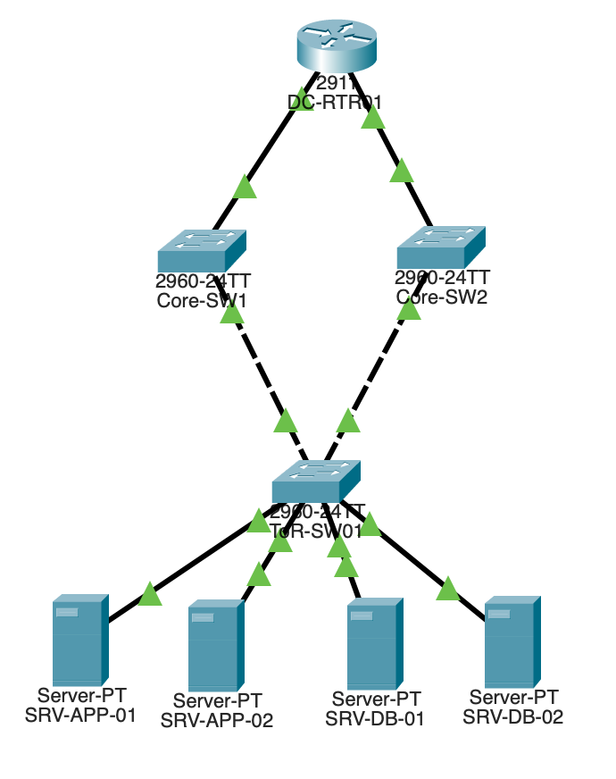
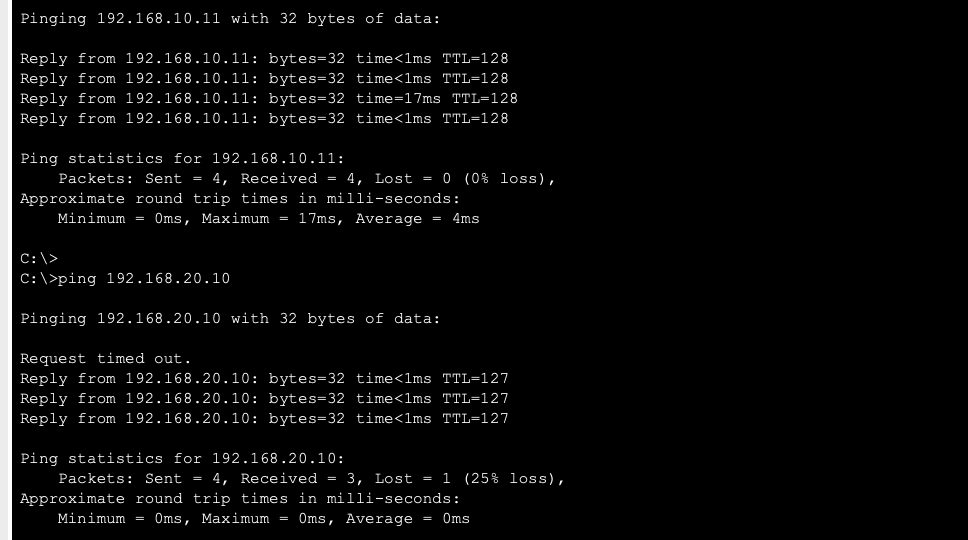

# DC network topology lab



A data center network topology built in Cisco Packet Tracer, reusing the
App/DB server roles from the
[Rack-Elevation-Cable-Management-Lab](https://github.com/Sagarpatel9/Rack-Elevation-Cable-Management-Lab)
project — that project modeled the physical rack; this one models the
network layer that runs on top of it. Together they tell one connected
story: physical build, then logical network design.

## Skills demonstrated

- **VLAN segmentation** — App and DB traffic kept on separate broadcast domains/subnets
- **Router-on-a-stick (inter-VLAN routing)** — one physical router link, split into 802.1Q-tagged sub-interfaces, routing between VLANs
- **Trunk vs. access port configuration** — correctly applied at each layer (core, ToR, server-facing)
- **Redundant switch-layer uplinks** — two paths from the top-of-rack switch to the core layer
- **CLI-based configuration** — every device configured via IOS commands, not GUI shortcuts, matching how this is actually done on real Cisco gear
- **Verification discipline** — confirmed every change with `show` commands rather than assuming it worked

## Topology

| Device | Role |
|---|---|
| `DC-RTR01` (Cisco 2911) | Layer 3 gateway, routes between VLANs via sub-interfaces on Gi0/0 |
| `Core-SW1` / `Core-SW2` (Cisco 2960) | Distribution-layer switches; both trunk down to the ToR switch |
| `ToR-SW01` (Cisco 2960) | Top-of-rack switch; two uplinks to the core layer, four access ports to servers |
| `SRV-APP-01` / `SRV-APP-02` | App servers, VLAN 10 (`192.168.10.0/24`) |
| `SRV-DB-01` / `SRV-DB-02` | DB servers, VLAN 20 (`192.168.20.0/24`) |

**Design logic, briefly:**
- The router only needs **one** physical link to reach both VLANs — its
  `Gi0/0` interface is split into two logical sub-interfaces
  (`Gi0/0.10`, `Gi0/0.20`), each tagged for one VLAN via 802.1Q
  encapsulation and holding that VLAN's gateway IP. This is the standard
  "router-on-a-stick" pattern.
- `ToR-SW01` has **two uplinks** (to Core-SW1 and Core-SW2) instead of
  one, so a single uplink failure doesn't cut the rack off from the
  network — the same redundancy principle used for the physical uplinks
  in the rack project.
- Every trunk port carries **both** VLANs (10 and 20), since traffic for
  either VLAN might need to cross any given trunk link on its way to the
  router.
- Server-facing ports on `ToR-SW01` are **access ports**, each assigned
  to exactly one VLAN, since servers don't understand VLAN tags — the
  switch handles tagging/untagging on their behalf.

## Configuration

### Router — VLAN sub-interfaces (router-on-a-stick)

```
interface gigabitEthernet0/0.10
encapsulation dot1Q 10
ip address 192.168.10.1 255.255.255.0

interface gigabitEthernet0/0.20
encapsulation dot1Q 20
ip address 192.168.20.1 255.255.255.0
```

### Core switches — VLANs + trunk ports

```
vlan 10
name App
vlan 20
name DB

interface range fastEthernet0/1 - 2
switchport mode trunk
```

### ToR switch — VLANs, trunk uplinks, and access ports

```
vlan 10
name App
vlan 20
name DB

interface range fastEthernet0/1 - 2
switchport mode trunk

interface fastEthernet0/3
switchport mode access
switchport access vlan 10

interface fastEthernet0/4
switchport mode access
switchport access vlan 10

interface fastEthernet0/5
switchport mode access
switchport access vlan 20

interface fastEthernet0/6
switchport mode access
switchport access vlan 20
```

## Verification

**VLAN assignment confirmed on ToR-SW01:**

```
ToR-SW01#show vlan brief

VLAN Name                             Status    Ports
---- -------------------------------- --------- -------------------------------
1    default                          active    Fa0/7, Fa0/8, Fa0/9, Fa0/10
                                                 Fa0/11, Fa0/12, ... Gig0/1, Gig0/2
10   app                              active    Fa0/3, Fa0/4
20   DB                               active    Fa0/5, Fa0/6
```

**Both uplinks confirmed active (no blocking) on ToR-SW01:**

```
ToR-SW01#show spanning-tree vlan 10
Interface        Role Sts Cost      Prio.Nbr Type
---------------- ---- --- --------- -------- --------------------------------
Fa0/1            Desg FWD 19        128.1    P2p
Fa0/2            Desg FWD 19        128.2    P2p
```

**Cross-VLAN routing confirmed with a live ping test** (App server →
DB server, crossing from VLAN 10 to VLAN 20 through the router):



The first packet timing out is expected, normal ARP behavior — the
router has to resolve the destination's hardware address before the
first packet can be delivered, which takes slightly longer than the
ping's timeout window. Every packet after that succeeds immediately,
confirming the route is working correctly.

## Known limitations / simplifications

Documented honestly rather than glossed over:

- **The router has two physical links** (Gi0/0 to Core-SW1, Gi0/1 to
  Core-SW2), but only Gi0/0 carries VLAN sub-interfaces and is actively
  routing traffic. Gi0/1 is physically up but intentionally left
  unconfigured. Giving it a second IP on the same subnet would *look*
  redundant without actually behaving that way, since servers only
  point to one default gateway — true gateway-level failover would
  require a second router running **HSRP** (or similar), which is a
  reasonable next step but wasn't built here.
- **No loop currently exists at the switch layer** in this topology
  (Core-SW1 and Core-SW2 aren't linked to each other, and the router
  doesn't participate in Spanning Tree the way a switch does), so STP
  isn't actively blocking either of ToR-SW01's uplinks — both are
  simultaneously forwarding. A stretch improvement would be linking
  Core-SW1 and Core-SW2 directly, which would create a real loop and
  let STP demonstrate active blocking/failover, closer to how a real
  redundant distribution layer is built.
- **VLANs were configured manually on each switch** rather than via
  VTP (VLAN Trunking Protocol) syncing — reasonable for a lab this
  size, but worth knowing VTP exists for larger deployments.

## Tools used

- Cisco Packet Tracer (Mac) — topology build and CLI configuration
